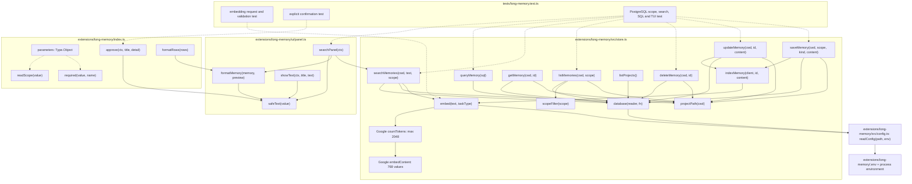
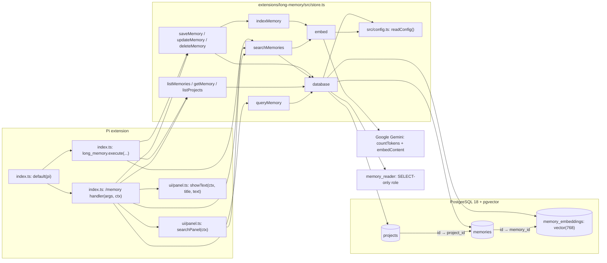
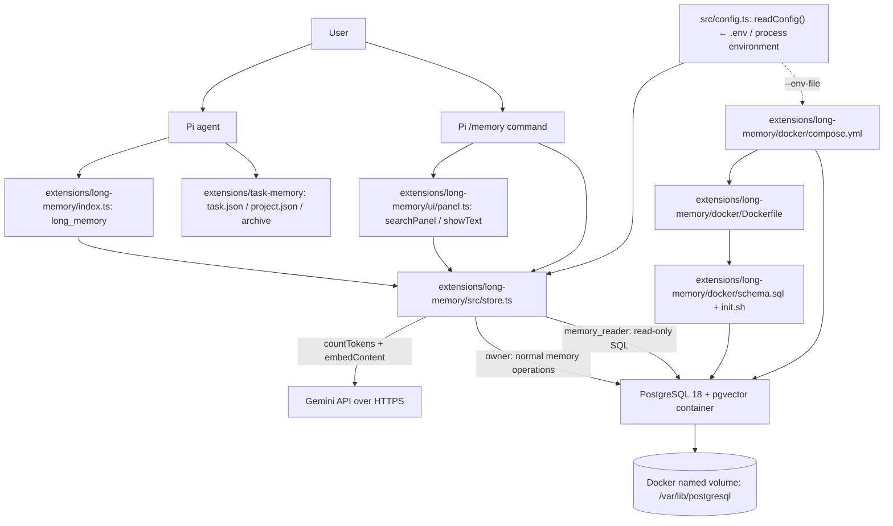
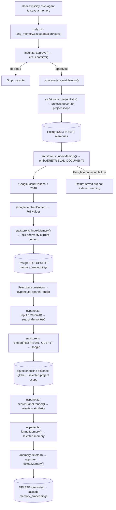

# Unit level

```mermaid
flowchart TD
  subgraph entry["extensions/long-memory/index.ts"]
    P["parameters: Type.Object"]
    R["required(value, name)"]
    S["readScope(value)"]
    A["approve(ctx, title, detail)"]
    F["formatRows(rows)"]
  end
  CFG["extensions/long-memory/src/config.ts: readConfig(path, env)"]
  ENV["extensions/long-memory/.env + process environment"]
  CFG --> ENV
  subgraph storage["extensions/long-memory/src/store.ts"]
    PP["projectPath(cwd)"]
    DB["database(reader, fn)"]
    SF["scopeFilter(scope)"]
    E["embed(text, taskType)"]
    CT["Google countTokens: max 2048"]
    EC["Google embedContent: 768 values"]
    IX["indexMemory(client, id, content)"]
    LM["listMemories(cwd, scope)"]
    SM["searchMemories(cwd, text, scope)"]
    GM["getMemory(cwd, id)"]
    SV["saveMemory(cwd, scope, kind, content)"]
    UP["updateMemory(cwd, id, content)"]
    DM["deleteMemory(cwd, id)"]
    LP["listProjects()"]
    QM["queryMemory(sql)"]
  end
  subgraph ui["extensions/long-memory/ui/panel.ts"]
    ST["safeText(value)"]
    FM["formatMemory(memory, preview)"]
    SP["searchPanel(ctx)"]
    OT["showText(ctx, title, text)"]
  end
  subgraph test["tests/long-memory.test.ts"]
    TE["embedding request and validation test"]
    TC["explicit confirmation test"]
    TI["PostgreSQL scope, search, SQL and TUI test"]
  end
  E --> CFG
  DB --> CFG
  E --> CT --> EC
  IX --> E
  SV --> PP & DB & IX
  UP --> PP & DB & IX
  DM --> PP & DB
  LM --> PP & SF & DB
  SM --> E & PP & DB
  GM --> PP & DB
  LP --> DB
  QM --> DB
  F --> FM --> ST
  A --> ST
  SP --> SM & FM & ST
  OT --> ST
  TE -.-> E
  TC -.-> A
  TI -.-> SV & UP & DM & LM & SM & QM & SP
  P -.-> R & S
```

# Integration level

```mermaid
flowchart LR
  subgraph pi["Pi extension"]
    REG["index.ts: default(pi)"]
    TOOL["index.ts: long_memory.execute(...)"]
    CMD["index.ts: /memory handler(args, ctx)"]
    PANEL["ui/panel.ts: searchPanel(ctx)"]
    VIEW["ui/panel.ts: showText(ctx, title, text)"]
  end
  subgraph service["extensions/long-memory/src/store.ts"]
    WRITE["saveMemory / updateMemory / deleteMemory"]
    READ["listMemories / getMemory / listProjects"]
    SEARCH["searchMemories"]
    SQL["queryMemory"]
    EMBED["embed"]
    INDEX["indexMemory"]
    CONNECT["database"]
    CONFIG["src/config.ts: readConfig()"]
  end
  subgraph postgres["PostgreSQL 18 + pgvector"]
    PROJECTS[("projects")]
    MEMORIES[("memories")]
    EMBEDDINGS[("memory_embeddings: vector(768)")]
  end
  GOOGLE["Google Gemini: countTokens + embedContent"]
  READER["memory_reader: SELECT-only role"]
  REG --> TOOL & CMD
  CMD --> PANEL & VIEW
  TOOL --> WRITE & READ & SEARCH
  CMD --> WRITE & READ & SEARCH & SQL
  PANEL --> SEARCH
  WRITE --> CONNECT & INDEX
  CONNECT --> CONFIG
  EMBED --> CONFIG
  INDEX --> EMBED --> GOOGLE
  SEARCH --> EMBED & CONNECT
  READ --> CONNECT
  SQL --> CONNECT --> READER
  CONNECT --> PROJECTS & MEMORIES & EMBEDDINGS
  PROJECTS -->|"id → project_id"| MEMORIES
  MEMORIES -->|"id → memory_id"| EMBEDDINGS
```

# System level

```mermaid
flowchart TD
  USER["User"]
  AGENT["Pi agent"]
  CMD["Pi /memory command"]
  TOOL["extensions/long-memory/index.ts: long_memory"]
  SCREEN["extensions/long-memory/ui/panel.ts: searchPanel / showText"]
  STORE["extensions/long-memory/src/store.ts"]
  TASK["extensions/task-memory: task.json / project.json / archive"]
  GEMINI["Gemini API over HTTPS"]
  COMPOSE["extensions/long-memory/docker/compose.yml"]
  DOCKERFILE["extensions/long-memory/docker/Dockerfile"]
  INIT["extensions/long-memory/docker/schema.sql + init.sh"]
  PG["PostgreSQL 18 + pgvector container"]
  VOL[("Docker named volume: /var/lib/postgresql")]
  CONFIG["src/config.ts: readConfig() ← .env / process environment"]
  USER --> AGENT & CMD
  AGENT --> TOOL & TASK
  CMD --> SCREEN & STORE
  TOOL --> STORE
  SCREEN --> STORE
  STORE -->|"countTokens + embedContent"| GEMINI
  STORE -->|"owner: normal memory operations"| PG
  STORE -->|"memory_reader: read-only SQL"| PG
  CONFIG --> STORE
  CONFIG -.->|"--env-file"| COMPOSE
  COMPOSE --> DOCKERFILE --> INIT --> PG
  COMPOSE --> PG --> VOL
```

# End-to-end level

```mermaid
flowchart TD
  REQUEST["User explicitly asks agent to save a memory"]
  TOOL["index.ts: long_memory.execute(action=save)"]
  CONFIRM["index.ts: approve() → ctx.ui.confirm()"]
  REJECT["Stop: no write"]
  SAVE["src/store.ts: saveMemory()"]
  PROJECT["src/store.ts: projectPath() → projects upsert for project scope"]
  INSERT[("PostgreSQL: INSERT memories")]
  INDEX["src/store.ts: indexMemory() → embed(RETRIEVAL_DOCUMENT)"]
  COUNT["Google: countTokens ≤ 2048"]
  VECTOR["Google: embedContent → 768 values"]
  LOCK["src/store.ts: indexMemory() → lock and verify current content"]
  INDEXED[("PostgreSQL: UPSERT memory_embeddings")]
  WARNING["Return saved but not indexed warning"]
  SEARCH["User opens /memory → ui/panel.ts: searchPanel()"]
  SUBMIT["ui/panel.ts: Input.onSubmit() → searchMemories()"]
  QUERY["src/store.ts: embed(RETRIEVAL_QUERY) → Google"]
  MATCH[("pgvector cosine distance: global + selected project scope")]
  RESULTS["ui/panel.ts: searchPanel.render() → results + similarity"]
  DETAIL["ui/panel.ts: formatMemory() → selected memory"]
  DELETE["/memory delete ID → approve() → deleteMemory()"]
  REMOVE[("DELETE memories → cascade memory_embeddings")]
  REQUEST --> TOOL --> CONFIRM
  CONFIRM -->|"declined"| REJECT
  CONFIRM -->|"approved"| SAVE --> PROJECT --> INSERT --> INDEX --> COUNT --> VECTOR --> LOCK --> INDEXED
  INDEX -->|"Google or indexing failure"| WARNING
  INDEXED --> SEARCH
  SEARCH --> SUBMIT --> QUERY --> MATCH --> RESULTS --> DETAIL
  DETAIL --> DELETE --> REMOVE
```
